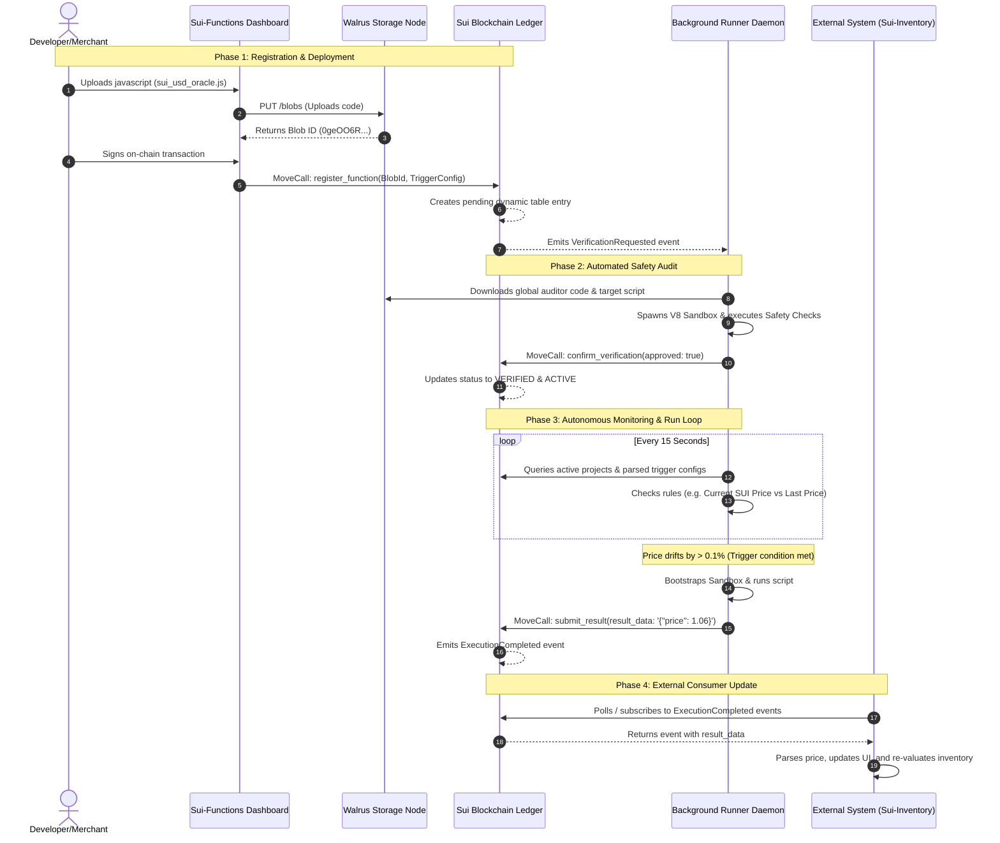

# Sui-Functions End-to-End Visual Flow Walkthrough

This document outlines the visual flow and behind-the-scenes mechanics of how a serverless function is registered, validated, dynamically triggered, and consumed within the Sui-Functions ecosystem.

---

## 1. Sequence Diagram

---

## 2. Phase-by-Phase Breakdown

### Phase 1: Registration & Deployment
* **Upload Code:** The developer uploads their serverless function (e.g., `sui_usd_oracle.js`) in the dashboard UI.
* **Walrus Storage:** The dashboard performs a `PUT` request uploading the file to a Walrus storage node. It receives a unique, immutable `Blob ID`.
* **On-Chain Registry:** The developer signs a transaction using their connected wallet. This executes the `register_function` entry point in the Move contract, adding the function name, version, Blob ID, and trigger configuration (e.g., `{"drift_threshold": 0.001}`) to the project registry dynamic table.
* **Event Dispatch:** The smart contract emits a `VerificationRequested` event containing the transaction details.

### Phase 2: Automated Safety Audit
* **Event Capture:** The runner node captures the `VerificationRequested` event from the Sui RPC stream.
* **Sandboxed Auditing:** The runner fetches the script source from Walrus and boots up a secure V8 isolate runtime with a platform-wide validation code block. It checks for common malicious behaviors (illegal access loops, memory exploits).
* **On-Chain Confirmation:** Once verified safe, the runner submits a `confirm_verification` transaction. The contract updates the function status flag on the blockchain state to `VERIFIED & ACTIVE` (`status = 1`).

### Phase 3: Autonomous Monitoring & Run Loop
* **Dynamic Scans:** The background runner polls the active projects on the ledger. It pulls their verified functions and parses their trigger configurations.
* **Price Monitor:** Every 15 seconds, the runner fetches the live SUI/USD exchange rate off-chain and compares it to the last saved execution price.
* **V8 Execution:** When the price drifts by more than `0.1%`, the trigger fires. The runner downloads the script, compiles it in a fresh V8 sandbox, executes the network fetch, and obtains the exact spot price.
* **On-Chain Submission:** The runner invokes `submit_result` on the smart contract. The contract emits an `ExecutionCompleted` event containing the verified output payload.

### Phase 4: External Consumer Update
* **State Sync:** The external merchant system (e.g., `sui-inventory`) queries or listens to `ExecutionCompleted` events from the Sui network.
* **Value Calculation:** When it receives the latest price update, the frontend parses the JSON result, updates its state variables, and recalculates total stock valuations instantly.
