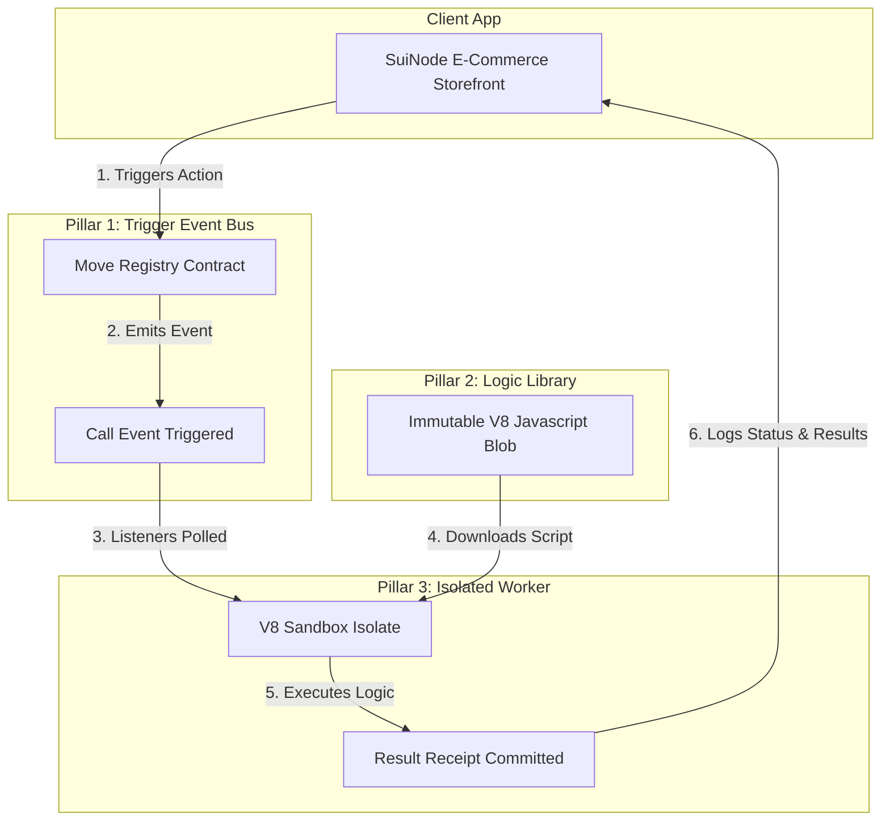

<p align="center">
  
</p>

<p align="center">
  <strong>Decentralized, unstoppable serverless execution for the Sui ecosystem.</strong>
</p>

<p align="center">
  
  
  
  
</p>

---

## 💡 What is Sui-Functions?

Sui-Functions is a next-generation decentralized serverless execution engine built for the **Sui Overflow 2026 Hackathon**. By marrying the security of the **Sui Blockchain** with the high-performance decentralized storage of the **Walrus Protocol**, Sui-Functions lets developers deploy and execute serverless code with **zero central dependencies**, **unhackable multi-sig deployment lifecycles**, and **near-zero execution overhead**.

---

## 🏛️ The Three Pillars Architecture

Sui-Functions decouples state coordination, logic immutability, and execution environments to achieve a secure, trustless serverless workflow:



1. **Pillar 1: The Trigger Event Bus (Sui Ledger)**
   * Move smart contracts coordinate the function registries, project ownership, dynamic trigger options, and execution receipts securely on-chain.
2. **Pillar 2: The Logic Library (Walrus Storage)**
   * Serverless JS/TS files are stored permanently on Walrus as immutable, content-addressed storage blobs, making supply-chain script poisoning attacks physically impossible.
3. **Pillar 3: The Isolated Workers (Secure Sandboxes)**
   * Lightweight daemon workers listen to Sui contract events, download the function blobs directly from Walrus nodes, and run them inside secure Google V8 sandbox execution environments (`isolated-vm`) with strict CPU and heap limits.

---

## ✨ Core Features

* **🛡️ Sandboxed V8 execution**: Enforces strict `128MB` memory heap limits, filesystem-blocking shims, and `5000ms` CPU timeouts to block exploit vectors.
* **🔒 Sovereign Upgrade Governance**: Project updates can be held by multi-sig wallets or DAO smart contracts. No single compromised API key can modify running code.
* **🌐 Decentralized Storefront Demo**: The repository comes with a full **SuiNode E-Commerce Storefront** where product price feeds and checkout discounts are validated on-chain in real-time.
* **💻 Interactive Developer Dashboard**: A rich web app built with React, TypeScript, and Ant Design that allows developers to manage projects, register/upgrade scripts, and trace execution logs.

---

## 📂 Project Structure

```text
├── sources/            # Sui Move smart contracts (Registry, triggers, and events)
├── runner/             # TypeScript worker engine (V8 sandboxing, listens for triggers)
├── website/            # React + TypeScript developer dashboard & builder workspace
├── sui-inventory/      # SuiNode E-Commerce storefront demo application
├── functions/          # Standard JS/TS scripts deployed on Walrus (e.g. coupon validator, oracle poller)
├── scripts/            # Shell scripts and utilities for Walrus blob uploads
└── tests/              # Smart contract unit tests
```

---

## 🚀 Getting Started

### 1. Smart Contract Deployment
To publish the Move contracts to Sui Testnet:
```bash
# Compile and deploy the contracts
sui client publish --gas-budget 100000000
```

### 2. Runner Configuration
Go to the `runner` folder to start the listener worker:
```bash
cd runner
npm install

# Setup environment config
# Configure package / registry ids inside .env
cp .env.example .env

# Run listener worker
npm run dev
```

### 3. Developer Dashboard
Start the React-based project dashboard:
```bash
cd website
npm install
npm run dev
```

### 4. E-Commerce Showcase (SuiNode Storefront)
Start the storefront demo app to trigger and witness on-chain actions:
```bash
cd sui-inventory
npm install
npm run dev
```

---

## 🛠️ Typical Workflow

1. **Deploy**: Upload code scripts (like `coupon_validator.js`) to Walrus and register the Blob ID on the Sui-Functions Registry.
2. **Call**: The storefront or external systems execute standard call transactions on the smart contract.
3. **Run**: The Runner daemon detects the transaction, fetches the matching script from Walrus, runs it securely inside V8, and commits execution status receipt records.

---

## 🏆 Hackathon Details
Sui-Functions was developed for the **Sui Overflow 2026 Hackathon**. Our goal is to provide a fully open-source, trustless, and robust serverless option to eliminate Web2 cloud lock-ins and security liabilities.

---

## 📄 License
Sui-Functions is distributed under the **MIT License**.
