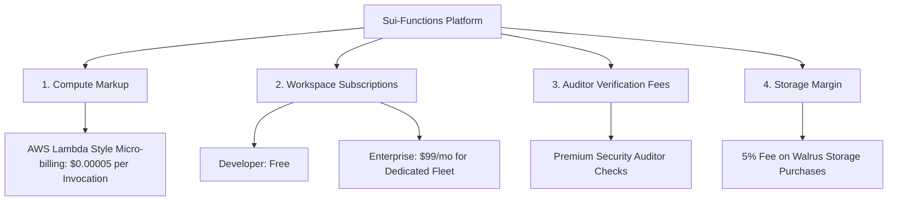

# Sui-Functions: Cost & Revenue Model (Production Blueprint)

This document establishes the economic architecture, operational cost projection, and monetization strategies for **Sui-Functions** in a production environment. 

---

## 1. Core Operating Costs

Sui-Functions has two main infrastructure dependencies: **Walrus (Decentralized Storage)** and **Sui Network (Smart Contract Registry & Execution Triggers)**, in addition to the **Off-chain Runner Fleet (Computation)**.

### A. Walrus Decentralized Storage Costs
All function source code and verification auditors are uploaded as decentralized blobs on the Walrus Protocol.
* **Leasing Fee Structure:** Storage on Walrus is purchased in epochs. 1 epoch is approximately **24 hours**. 
* **Pricing (Current Estimate):** Storage cost is determined by the Walrus storage market. At present testnet/devnet assumptions, renting 1 MB of storage for 1 year (365 epochs) costs under **0.1 SUI**. Since JavaScript functions are tiny (typically $5\text{ KB} - 100\text{ KB}$), storage costs are highly negligible per function.
* **Storage Rebates:** When a project or function is deleted from the registry (via `delete_project` or `delete_function`), the storage object is destroyed on-chain, and Sui/Walrus returns the storage deposit (rebate) directly to the transaction signer. This keeps registry clean-up highly cost-efficient and encourages clean-up.

### B. Sui Network Gas Fees
Every function registration, deletion, and execution trigger emits events or writes to dynamic fields on the Sui ledger.
* **Registrations & Settings:** Charged directly to developers when they set up settings or register functions.
* **Automated Triggering:** The off-chain runner listens for events and writes back results via transaction execution.
* **Execution Fee:** Execution of a simple trigger callback function costs roughly **0.002 - 0.005 SUI** per execution, depending on state mutations.

### C. Runner Fleet Compute Costs
Off-chain runner daemons run in isolated micro-VM sandboxes (e.g., using `isolated-vm` V8 isolate wrappers).
* **Node Infrastructure:** CPU/Memory allocation for running sandboxed JS processes.
* **Operational Overhead:** Low CPU and memory requirements per execution ($\approx 10\text{ms}$ CPU time, $15\text{MB}$ RAM), allowing thousands of concurrent invocations to run on basic cloud instances ($15 - $30 / month per runner node).

---

## 2. Revenue Model & Monetization Channels

Sui-Functions employs a multi-tiered monetization strategy tailored to decentralized micro-billing and traditional SaaS models.

### 1. Compute Execution Markup (AWS Lambda Style)
This is the primary revenue engine for Sui-Functions.
* **Mechanism:** Developers fund their Workspace Project accounts with SUI. For every successful execution trigger, Sui-Functions charges a small premium over the raw Sui gas cost.
* **Micro-billing Example:**
  * **Raw gas cost:** $0.003\text{ SUI}$
  * **Sui-Functions fee:** $0.0031\text{ SUI}$ (adding a $0.0001\text{ SUI}$ / execution service fee).
  * **Margin:** $\approx 3.3\%$ markup. At scale (100 million invocations per month), this yields **10,000 SUI** per month in pure protocol profit.

### 2. Workspace Tiered Subscriptions
For teams and enterprises requiring guaranteed SLAs, custom triggers, or isolated computation resources.

| Tier | Price / Month | Features Included |
| :--- | :--- | :--- |
| **Developer (Free)** | $0 | Shared runner fleet, up to 5 workspaces, community-based auditor scans. |
| **Professional** | $29 / month | Dedicated dashboard runner priority, 50 workspaces, auto-retry on execution failure, 100K free executions. |
| **Enterprise** | $149 / month | **Private Runner Fleet** (users spin up their own node with zero shared cold starts), unlimited workspaces, custom Auditor script configs, 24/7 SLA. |

### 3. Advanced Auditor Verification Fees
Security is paramount. The system leverages independent on-chain auditors.
* **Standard Verification:** Free automated AST check (using the default JS parser auditor).
* **Premium Auditing:** AI-driven vulnerability scanners and formal verification engines are charged per registration (e.g., $0.5\text{ SUI}$ per update) to ensure code is clean, reentrancy-free, and contains no hidden malicious logic.

### 4. Storage Facilitation Fee (Walrus Convenience Margin)
* When a developer uploads a script directly from the dashboard, the dashboard manages Walrus transactions on their behalf.
* A micro-convenience fee (e.g., 5%) is added to the Walrus lease price when funding via the app dashboard.

---

## 3. Protocol Economics & Profitability Strategy

1. **Rebate Harvesting:** Deleted workspaces refund their storage deposits to the protocol treasury if the protocol originally paid the storage lease during onboarding.
2. **Deflationary Loop:** A portion of execution markups can be burned or routed into a governance pool to back SUI validators running dedicated Sui-Functions runners.
3. **Zero Capital Infrastructure:** Because developers pay for storage directly in SUI (epochs purchased live) and cover trigger execution gas via workspace funding, the platform holds zero inventory/idle capital costs. Running costs scale 1:1 with customer usage.
